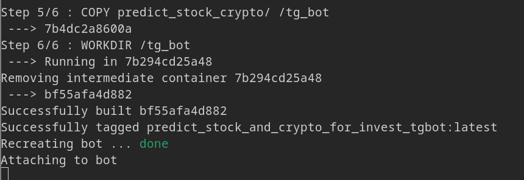

# Телеграм бот для предсказания цены на криптовалюту

## Для чего этот бот

Бот предсказывает цены криптовалют (на ближайшие 3 недели), которые добавлены в избранные пользователя (по-умолчанию их максимум 3 позиции).

На выбранные криптовалюты можно узнать:

- прогноз цен **на ближайшие 2 недели**;
- уровни "_Low_" поддержки (с наглядной отрисовкой графика за последний год. Если есть данные);
- уровни "_High_" поддержки (с наглядной отрисовкой графика за последний год. Если есть данные).

> Уровни поддержки нужны для того, чтобы принять верное решение по покупке \ продаже.

В боте реализована система добавления\удаления и хранение списка выбранных акций.
А так же удобное навигационное меню - оно адаптивное и может "растягиваться" в зависимости от кол-ва акций в списке избранного (отображается в виде кнопок).

Вот наглядный пример, что из себя представляет бот:


## Используемые технологии

- **investpy** = Для получения исторических данных цен по криптовалютам
- **pandas** = Для работы с историческими данными
- **beatifulsoup4** = Для парсинга предиктовых цен на криптовалюты
- **python-telegram-bot** = Для работы с телеграм в качестве бота (рассылка сообщений, графиков)
- **matplotlib** = Для отрисовки графиков цен на криптовалюты в годовом отрезке
- **sqlite3** = Для хранения списка криптовалют и избранных криптовалют у пользователей

## Подготовка к запуску

Перед запуском, нужно подготовить специальный файл `.env` (переменные виртуального окружения).

В этом файле будет храниться две **обязательные** переменные (Токен и ID чата).

Создайте файл `.env`, заполните переменные и поместите файл в директорию `config/`

```
TOKEN=<Токен вашего телеграм бота>
CHAT_ID=<Чат, в который бот присылать графики (вы сами)>
```

## Запуск

### Стандартный запуск

Когда подготовительные работы завершены, можно приступать к запуску.

Для начала, создайте виртуальное окружение:

```bash
python -m venv venv
```

И установите все необходимые зависимости проекта:

```bash
pip install -r requirements.txt
```

Теперь можно запускать проект:

```bash
python main.py
```

Осталось только перейти в телеграм и использовать бота по назначению.

### Запуск с помощью Docker

Проект так же настроен для запуска и в Docker

> У вас должен быть установлен docker и docker-compose
> Так же убедитесь, что сам докер запущен: `sudo systemctl status docker`

Сборка и запуск в Docker командой:

```bash
docker-compose up --build
```

Если всё сделанно верно, то вас будет встречать:



Можете пользоваться ботом.

## Дополнительный функционал

В проекте реализован GitHub Actions (Workflow) ('.github/worflows/main.yml').
Вы можете использовать его и в своём проекте при клонировании этого репозитория.

Активируется при отправке изменений на GiHub репозиторий (git push)

GitHub Actions состоит из 3-х jobs:

- **formatting_and_test** = Проверка кода Линтером (flake8) и форматтером (black), и проведение Unittest тестирования.
  (тесты в workflow на получения данных с investpy не проходят, т.к. GiHub блокирует сторонее соединение)
- **build_and_push_to_docker_hub** = Сборка и публикация образа на DockerHub
  (для этого нужно добавить DOCKER_USERNAME, DOCKER_PASSWORD и NAME_REPO в файл '.env')
- **deploy** = загрузка образа на сервер и его активация
  (этот job отключен, но вы можете ознакомиться самостоятельно ознакомиться с его настройками в файле '.github/worflows/main.yml')

В проекте так же встроено логирование (библиотека Logging), которое сможет помочь вам, если что-то вдруг не получается в запуске проекта.

Сами логи хранятся в директории `config/logging/`.

По-умолчанию, собираются логи только _ERROR_ уровня, но вы можете самостоятельно изменить уровень логирования в файле `settings.py`
